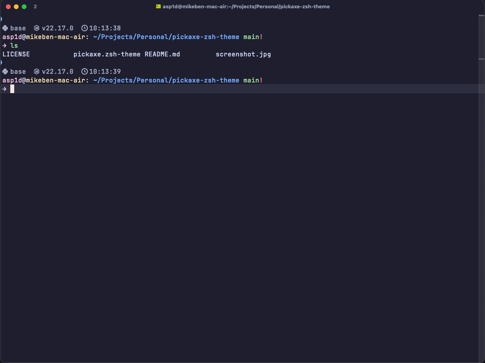

# pickaxe [zsh][2] theme



## ⚙️ Customization

You can easily modify and customize the theme colors and err emoji by editing the `pickaxe.zsh-theme` file.

## 🚀 Installation

1. Clone the repository into the oh-my-zsh [custom themes][1] directory
```bash
    git clone https://github.com/mikhaben/pickaxe-zsh-theme.git ~/.oh-my-zsh/custom/themes/pickaxe
```

2. Set the theme in your `~/.zshrc` file
```
    ZSH_THEME="pickaxe/pickaxe"
```

3. Reload your terminal
```bash
    source ~/.zshrc
```

## 💡 Recommendations

For the best experience with this theme, we recommend:

### Nerd Fonts
Install a [Nerd Font][3] to display icons properly. Recommended fonts:
- **FiraCode Nerd Font** (modern, clean)
- **MesloLGS NF** (popular with Powerlevel10k users)
- **JetBrains Mono Nerd Font**

### Catppuccin Color Theme
Apply the beautiful [Catppuccin][4] color theme to your terminal for a cohesive, aesthetic experience.


[1]: https://github.com/ohmyzsh/ohmyzsh/wiki/Customization#overriding-and-adding-themes
[2]: https://ohmyz.sh
[3]: https://www.nerdfonts.com/
[4]: https://catppuccin.com
