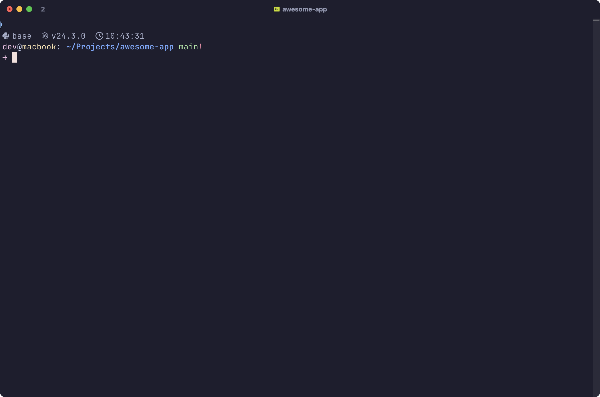

# pickaxe [zsh][2] theme



## 🚀 Installation

The theme is a single file — download it straight into the oh-my-zsh
[custom themes][1] directory.

1. Download the theme
```bash
    curl -fsSL -o ~/.oh-my-zsh/custom/themes/pickaxe.zsh-theme \
      https://raw.githubusercontent.com/mikhaben/pickaxe-zsh-theme/main/pickaxe.zsh-theme
```

2. Set the theme in your `~/.zshrc` file
```
    ZSH_THEME="pickaxe"
```

3. Reload your terminal
```bash
    source ~/.zshrc
```

To update, run the same `curl` command again.

### Working on the theme

Clone it and symlink the file instead, so your edits and `git pull` apply straight away:

```bash
    git clone https://github.com/mikhaben/pickaxe-zsh-theme.git
    ln -sf "$PWD/pickaxe-zsh-theme/pickaxe.zsh-theme" ~/.oh-my-zsh/custom/themes/pickaxe.zsh-theme
```

`screenshot.zsh` opens a throwaway shell with a generic `user@host`, so screenshots
do not publish your account and machine name. Your normal config loads, so the
prompt shows real node/conda/git info — only `%n` and `%m` are substituted, along
with the terminal title, which leaks the same string. Exit with Ctrl-D.

```bash
    ./screenshot.zsh                 # dev@macbook
    ./screenshot.zsh alice thinkpad  # alice@thinkpad
```

## ⚙️ Customization

Edit `pickaxe.zsh-theme` to change colors, the error emoji set (`ERROR_CHARS`),
or the icons.

A few behaviours worth knowing:

- **Failures show the exit code** — `💀 FAIL 127` — so you can tell a missing
  command from a real error.
- **Ctrl-C stays quiet.** An interrupt (exit code `130`) is not a failure, so it
  does not print the error line.
- **Deep paths collapse in the middle** — `~/Projects/…/current-folder`. Paths of
  three or fewer components are shown in full.
- **Nerd Font icons are used by default.** Set `PICKAXE_MODE=emoji` before the
  theme loads to force the emoji fallback, or `PICKAXE_MODE=nerdfont` to be explicit.

## 💡 Recommendations

For the best experience with this theme, we recommend:

### Nerd Fonts
Install a [Nerd Font][3] to display icons properly. Recommended fonts:
- **FiraCode Nerd Font** (modern, clean)
- **MesloLGS NF** (popular with Powerlevel10k users)
- **JetBrains Mono Nerd Font**

### Catppuccin Color Theme
Apply the beautiful [Catppuccin][4] color theme to your terminal for a cohesive, aesthetic experience.


[1]: https://github.com/ohmyzsh/ohmyzsh/wiki/Customization#overriding-and-adding-themes
[2]: https://ohmyz.sh
[3]: https://www.nerdfonts.com/
[4]: https://catppuccin.com
