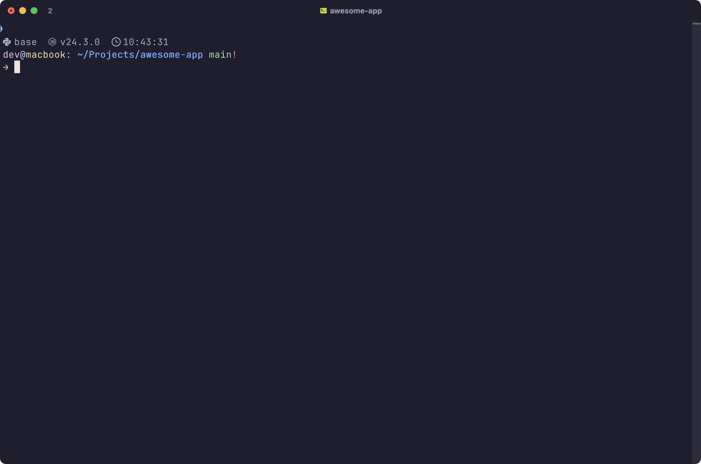

# pickaxe [zsh][2] theme



## 🚀 Installation

The theme is a single file — download it straight into the oh-my-zsh
[custom themes][1] directory.

1. Download the theme
```bash
    curl -fsSL -o ~/.oh-my-zsh/custom/themes/pickaxe.zsh-theme \
      https://raw.githubusercontent.com/mikhaben/pickaxe-zsh-theme/main/pickaxe.zsh-theme
```

2. Set the theme in your `~/.zshrc` file
```
    ZSH_THEME="pickaxe"
```

3. Reload your terminal
```bash
    source ~/.zshrc
```

To update, run the same `curl` command again.

### Working on the theme

Clone it and symlink the file instead, so your edits and `git pull` apply straight away:

```bash
    git clone https://github.com/mikhaben/pickaxe-zsh-theme.git
    ln -sf "$PWD/pickaxe-zsh-theme/pickaxe.zsh-theme" ~/.oh-my-zsh/custom/themes/pickaxe.zsh-theme
```

`screenshot.zsh` opens a throwaway shell with a generic `user@host`, so screenshots
do not publish your account and machine name. Your normal config loads, so the
prompt shows real node/conda/git info — only `%n` and `%m` are substituted, along
with the terminal title, which leaks the same string. Exit with Ctrl-D.

```bash
    ./screenshot.zsh                 # dev@macbook
    ./screenshot.zsh alice thinkpad  # alice@thinkpad
```

## ⚙️ Customization

Set any of these in `~/.zshrc` before oh-my-zsh loads the theme:

```zsh
PICKAXE_MODE=emoji               # emoji icons instead of Nerd Font glyphs
PICKAXE_PWD_MAX_LEN=60           # collapse the path only past 60 characters (default 40)
PICKAXE_CMD_MAX_EXEC_TIME=10     # show "took 12s" only for commands over 10s (default 5)
PICKAXE_ERROR_CHARS=("💥" "🧨")   # emoji picked at random on failure
PICKAXE_COLOR_DIR=cyan           # also _USER _ROOT _HOST _INFO _ERROR _TIME _GIT _GIT_AHEAD _GIT_DIRTY
```

Colors take any `%F{...}` value: a name like `cyan` or a 256-color number like `208`.

The theme also works without oh-my-zsh: `source /path/to/pickaxe.zsh-theme` from `~/.zshrc`.

A few behaviours worth knowing:

- **Failures show the exit code**, `💀 FAIL 127`, so you can tell a missing
  command from a real error. The line explains odd codes too:
  `FAIL 137 (KILL)` for a killed process, `FAIL 1 (0|1|0)` for the pipeline
  stage that failed, and `FAIL 1 (! inverted 0)` when a leading `!` turned a
  successful command into a failure. zsh negates the exit code of any command
  that starts with `! `.
- **Pressing Enter on an empty line clears the error.** The failure line belongs
  to the command that just ran, not to the one before it.
- **Ctrl-C and Ctrl-Z stay quiet.** Exit codes `130` and `148` are your doing,
  not failures.
- **Slow commands show their run time**, `took 1m 12s`, once they pass
  `PICKAXE_CMD_MAX_EXEC_TIME`.
- **Git shows more than the branch**: `main ⇡1⇣2 +1 !2 ?3` means one commit
  ahead, two behind, one staged (`+`), two unstaged (`!`) and three untracked
  (`?`) files. `=` counts merge conflicts, and a detached HEAD shows as
  `@abc1234`.
- **Deep paths collapse in the middle**, `~/Projects/…/current-folder`, once the
  path is longer than `PICKAXE_PWD_MAX_LEN` characters.
- **The active Python env is shown**: a venv (including uv's `.venv`, by project
  name) wins over a conda env.

## 💡 Recommendations

For the best experience with this theme, we recommend:

### Nerd Fonts
Install a [Nerd Font][3] to display icons properly. Recommended fonts:
- **FiraCode Nerd Font** (modern, clean)
- **MesloLGS NF** (popular with Powerlevel10k users)
- **JetBrains Mono Nerd Font**

### Catppuccin Color Theme
Apply the beautiful [Catppuccin][4] color theme to your terminal for a cohesive, aesthetic experience.


[1]: https://github.com/ohmyzsh/ohmyzsh/wiki/Customization#overriding-and-adding-themes
[2]: https://ohmyz.sh
[3]: https://www.nerdfonts.com/
[4]: https://catppuccin.com
