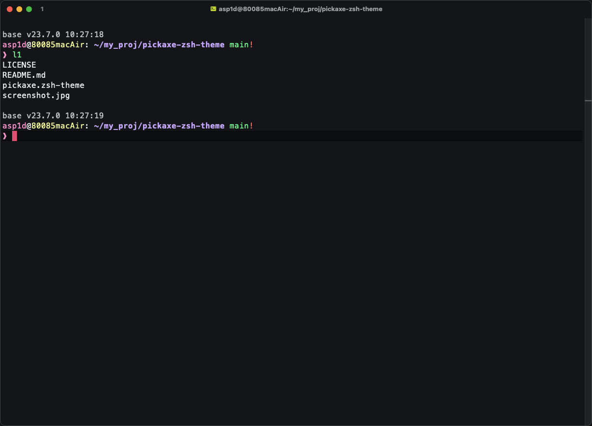

# pickaxe [zsh][2] theme



### ⚙️ Customization

You can easily modify and customize the theme colors and err emoji by editing the `pickaxe.zsh-theme` file.

### 🚀 Installation

1. Clone the repository into the oh-my-zsh [custom themes][1] directory
```bash
    git clone https://github.com/mikhaben/pickaxe-zsh-theme.git ~/.oh-my-zsh/custom/themes/pickaxe
```

2. Set the theme in your `~/.zshrc` file
```
    ZSH_THEME="pickaxe/pickaxe"
```

3. Reload your terminal
```bash
    source ~/.zshrc
```

[1]: https://github.com/ohmyzsh/ohmyzsh/wiki/Customization#overriding-and-adding-themes
[2]: https://ohmyz.sh
